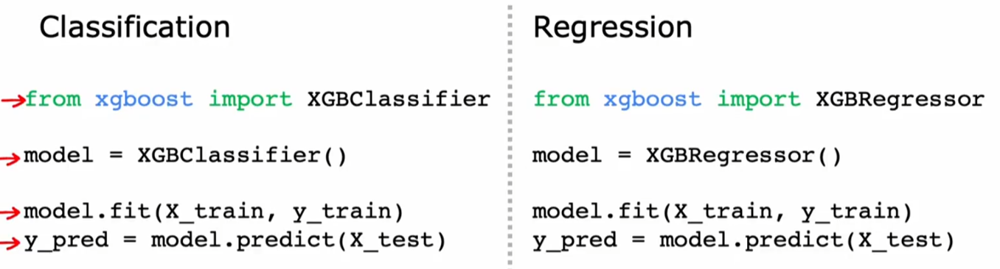

## 神经网络

### 需求预测

<br>a指的是神经元向下游的其他神经元发送高输出的程度

这个逻辑回归就是一个神经元,一个输入x,一个"处理器",得到一个输出

layer:是一组神经元,他们一相同或者相似的特征为输入,并依次输出值.一个神经元的输出就是他的激活值a(activations)

但是对于神经元很多的layer来说,我们很难手动去标注哪些神经元处理什么特征,我们只能把每个值输入每个神经元,再让他们来判断权重.然后,为了简化,我们会将这写输入的数值集视作"特征向量"

换一个角度来看,我们把输入层隐藏,只看中间层(hidden layer)和输出层,输出层就相当于一个逻辑回归,他接收的特征是$\vec{a}$(中间层最后输出的处理过的特征)

这三个特征是决定top saler的非常好的三个特征.之前说的特征工程中我们选择长宽相乘得到面积作为新特征,这是我们手动选择的一个更好的特征,而神经网络则是学习出最好的特征.

### (示例)人脸...识别

以$\vec{x}$作为输入,这个人的名字作为输出

没人告诉神经网络他们要学什么,第一层学一些人类的极小片段,第二处开始学习人脸的一些细小局部...

### 神经网络层

层是神经网络的基本构建部分

注意黄色的特征向量和layer1输出的特征向量,每个神经元都相当于一个逻辑回归,比如第一个神经元,就是输出的对可支付性的概率判断

一些记号:上方括号表示层

### 更复杂神经网络


单元j指的是一个层中第j个神经元.g指的是激活函数(非线性)

### 推理:预测与前向传播

对这个手写的数字进行判断<br>

较为常见的架构:隐藏层的神经元数量越靠近输出层越少

### TensorFlow

神经网络的一个特点是相同的算法可以应用在不同场景

在烘焙咖啡豆的时候,火候和时间很重要,我们建立了三个特征判断是否是好咖啡——烘短了、火大了、烘过了

具体的实现<br>

### TensorFlow中的数据表示


```python
import numpy as np
```


```python
x=np.array([[1,2,3],[4,5,6]])
#[1 2 3]
#[4 5 6]
x=np.array([[200,17]])#1x2matrix
x=np.array([[200],[17]])#2x1matrix
x=np.array([200,17])#没有行列的线性数组
```

TensorFlow的层出入numpy的数组会输出TensorFlow的张量,使用.numpy()将之转换为numpy数组

### 构建神经网络


```python
import tensorflow as tf
from tensorflow.keras import models, layers
from tensorflow.keras.layers import Dense
from tensorflow.keras.models import Sequential
import warnings
warnings.filterwarnings("ignore", category=FutureWarning)
```

    d:\Programs\miniconda\Lib\site-packages\keras\src\export\tf2onnx_lib.py:8: FutureWarning: In the future `np.object` will be defined as the corresponding NumPy scalar.
      if not hasattr(np, "object"):
    


```python

model=Sequential([
    Dense(units=3,activation="sigmoid"),
    Dense(units=1,activation="sigmoid")
])
x=np.array([[100.0,17.0],
            [120.0,5.0],
            [425.0,20.0],
            [212.0,18.0]])
y=np.array([1,0,0,1])#target
```

### 单层前向传播


$wm\_n=w_m^{[n]}$

### 神经网络的向量化

利用矩阵乘法代替向量点乘的循环,可以更加高效的实现神经网络

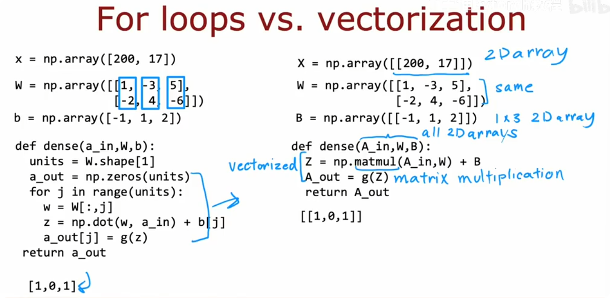

### 矩阵乘法

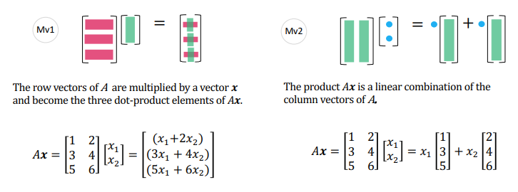

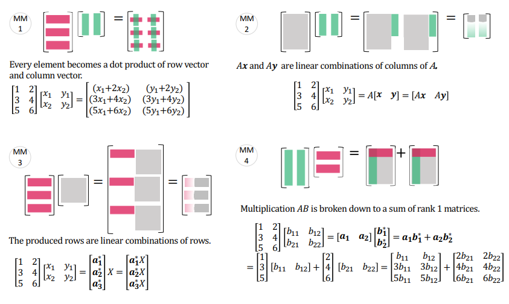

注意在numpy中,数组的向量的表示


```python
A=np.array([1,23,4,5])#一个数组(一维向量)
A=np.array([[1,23,4,5]])#一个1x2矩阵
AT=A.T#此为numpy库的 transpose 
```


```python
Z=np.matmul(AT,A)
if Z.all() == (AT@A).all():#@代表矩阵乘法
    print(Z)
```

    [[  1  23   4   5]
     [ 23 529  92 115]
     [  4  92  16  20]
     [  5 115  20  25]]
    

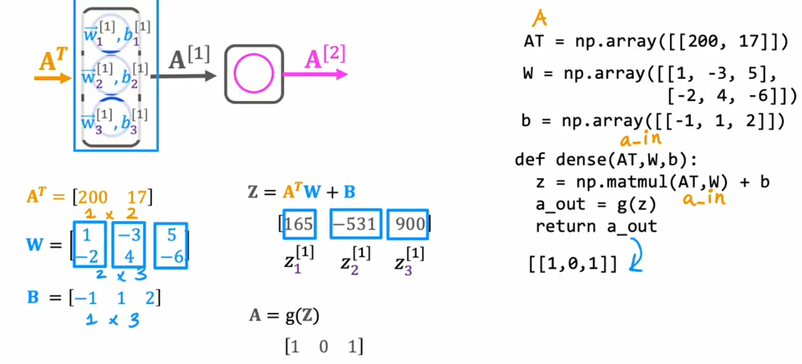

$A^T$就是输入的"特征向量",$A^TW$就是$W$的每一列都乘以$A^T$,最后加上$B$,再套一层激活函数就得到激活值

## 神经网络训练

### TensorFlow的实现


```python
import tensorflow as tf
from tensorflow.keras import Sequential
from tensorflow.keras.layers import Dense
model = Sequential([
    Dense(units=25,activation='sigmoid'),
    Dense(units=15,activation='sigmoid'),
    Dense(units=1,activation='sigmoid')
])
from tensorflow.keras.losses import BinaryFocalCrossentropy
#二元交叉熵损失函数,这里的二元指的是0,1两种取值
model.compile(loss=BinaryFocalCrossentropy)
#model.fit(X,Y,epochs=100)#epochs是学习次数
```

三个步骤:1.创建模型 2.使用特定函数编译损失 3.训练模型

#### 一些细节

这里对应了线性回归和逻辑回归中的f(x)的选择,也就是你的预测函数是f(x)=wx+b还是f(x)=sigmoid(wx+b)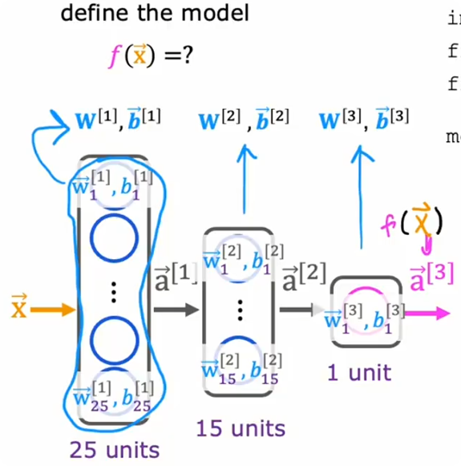

y——target label

fit利用反向传播得到梯度下降的偏导项


```python
A=np.array([[1,2,3],
            [4,5,6],
            [7,8,9],
            [4,2,1]])
print(A.shape[0])#行
print(A.shape[1])#列
```

    4
    3
    

### sigmoid激活函数的替代

$$ReLU(z)=max(0,z)$$

上面两个是非线性的激活函数,相应地还有线性激活函数g(z)=z

### 选择激活函数

对于输出层,通常会根据目标或真实标签选择考虑激活函数时,比如二分类就是sigmoid,回归问题有时是线性激活函数,有时是ReLU(显然要求你非负)

对于隐藏层,主要使用ReLU,原因如下:<br>1.ReLU的"Not flat"区域要大一点,sigmoid在某区域以外就是"flat"了,那么此处进行梯度下降就会较慢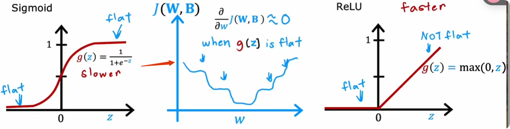2.ReLU计算速度稍微快

Dense函数里activation的字符串还有'relu'和'linear'

还有一些其他的激活函数,在一些罕见的情况下会非常有效

### 选择激活函数的原因

如果每一个激活函数都使用linear激活函数或者不使用激活函数,那么再庞大的神经网络都无异于一个线性回归,它只能拟合一个线性模型,这显然是不行的.不要再隐藏层中使用线性函数

### 多分类问题

例如手写识别(0~9),工厂的零件等级都属于多分类问题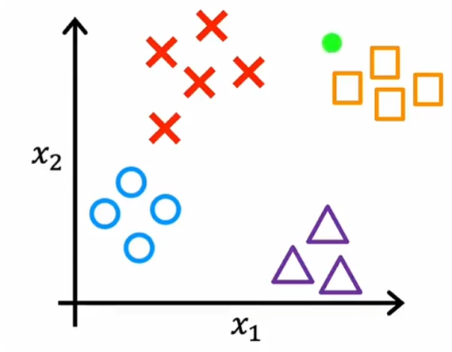

### Softmax

Softmax是逻辑回归的泛化:

sigmoid函数可以写为$$sigmoid(z)=P(y=1)=\frac{e^z}{e^z+e^0}$$可以看出,他是对0,z进行概率(100%)的分配

所以对于推广的Softmax,则是$$z_i=\vec{w_i} \cdot \vec{x}+b_i$$激活值就是$$a_i=\frac{e^{z_i}}{\sum e^{z_k}}=P(y=i|\vec{x})$$对应的损失为$$loss=-ln(a_i)~when~y=i$$

### 带有softmax的神经网络输出

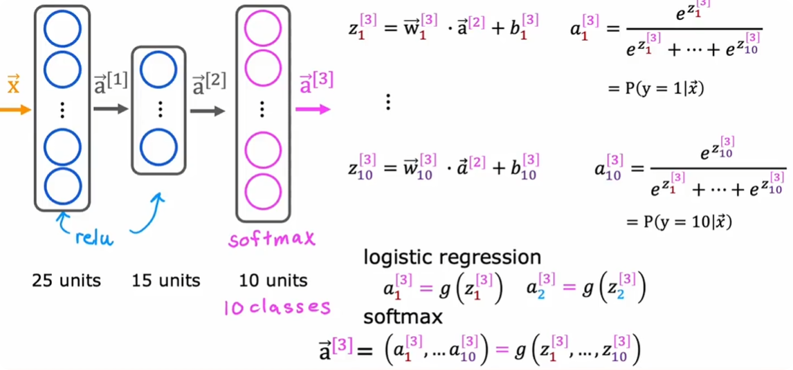

分子的指数放大差距


Dense中的activation的字符串为'softmax',在编译损失的时候使用稀疏分类交叉熵函数(SparseCategoricalCrossentropy),这里稀疏指的是单射

### Softmax优化


```python
print(2.0/10000)
print(1+(1/10000)-(1-1/10000))
```

    0.0002
    0.00019999999999997797
    

我们最好将sigmoid函数\softmax函数直接整合到loss的计算中(尤其是softmax)

我们在输出层直接使用linear激活函数,然后把编译损失部分加入<br><br>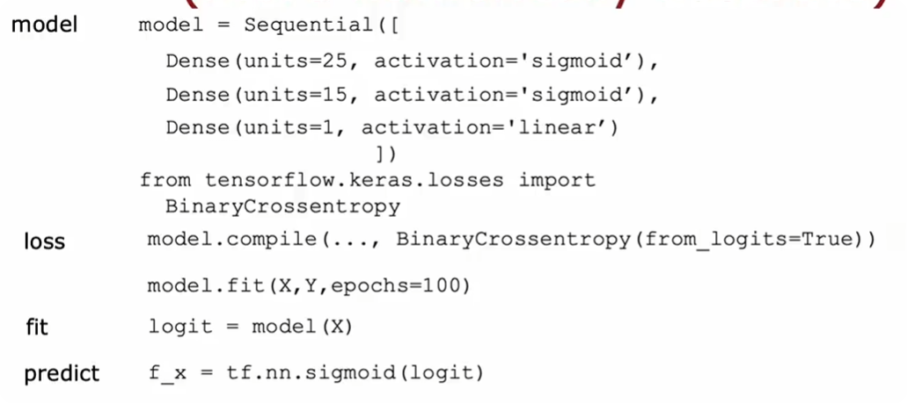

### 多标签分类

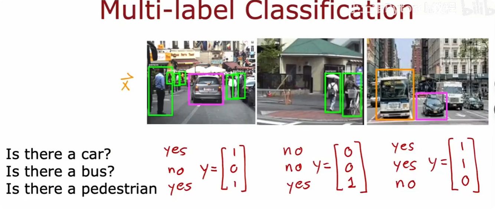

多标签分类是多个逻辑回归(sigmoid),而多分类有多种输出值(softmax)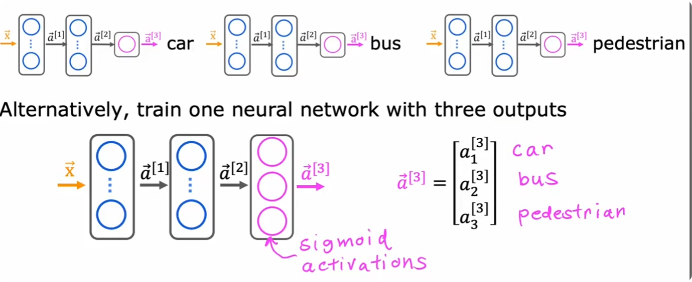

### 高级优化

针对$\alpha$自动进行调整———Adam Algorithm(自适应矩估计)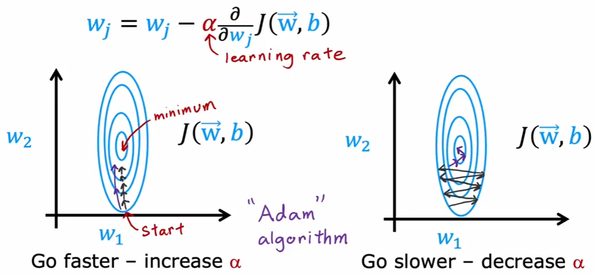

在complie的优化器选择Adam<br>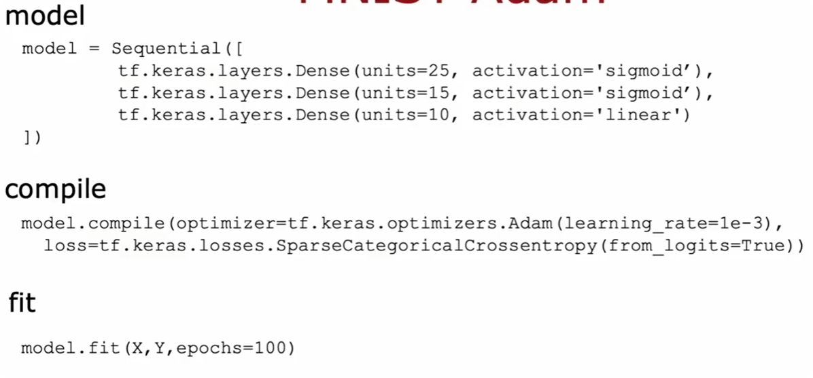

### 额外的层类型

目前为止,我们使用的所有神经网络层都是全连接层(Dense Layer)

卷积层(Convolutional Layer):每一个神经元都只看一部分的上一个层的输出<br>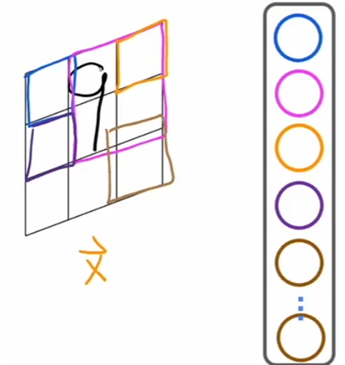<br>这使其有更快的速度,更少的训练数据需求,更低的过拟合

其他的例子<br>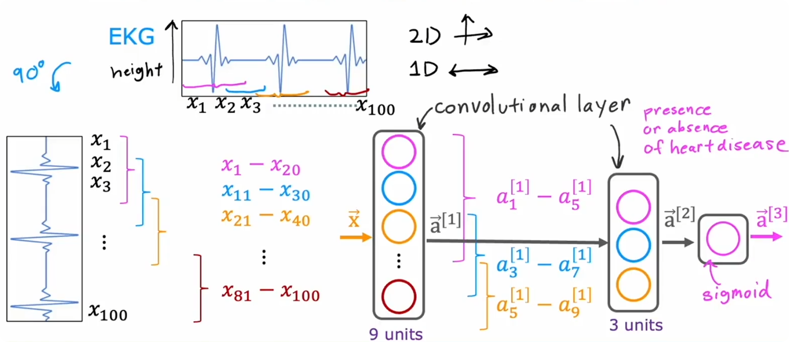

### 计算图

以一个只有一层(该层只有一个神经元)的神经网络为例(前项传播):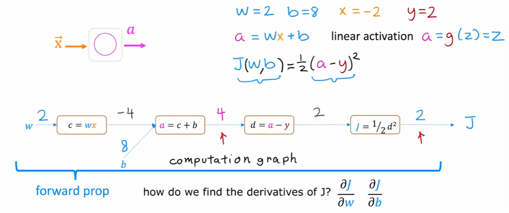

计算每一个参数对J的偏导(反向传播):

反向传播只需要一次就可以从右向左计算出所有的偏导数,但是前项传播,你需要把每一条路径的每个相邻参数的偏导数乘起来

### Bigger神经网络实例


## 应用机器学习的建议

### 构建机器学习系统时的决策

诊断:观察在某个学习算法下,哪些功能运作或不运作了,以此使得系统更好运作

### 评估模型

对于数据集,选取一部分(70%)作为训练集,剩下的作为测试集

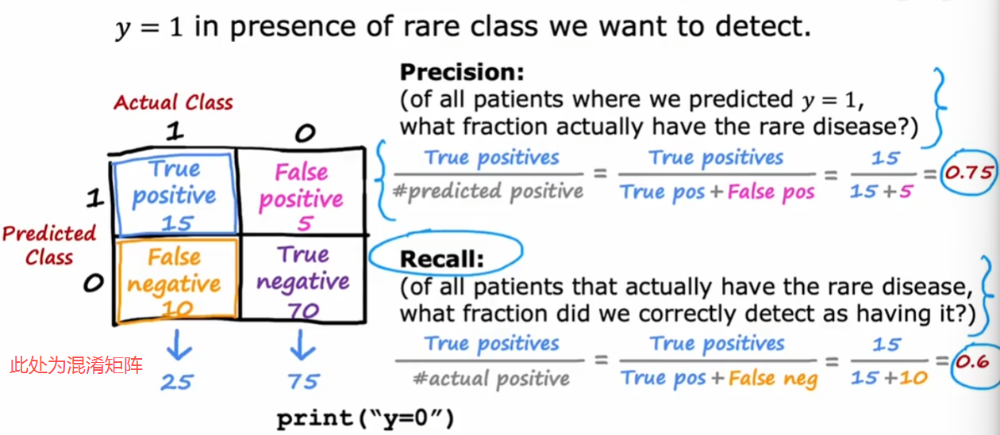

对于逻辑回归,我们利用误分类的比例来度量代价函数

### 模型选择

例如对于房价预测,我们需要考虑一下需要几次的函数来拟合<br><br>为什么呢?利用测试集做模型的选择本身就是错误的.这么做就相当于给一个人连着考10次试,然后选择他分数最高的一次当做他的真实水平.这样所谓的"真实水平"就获得了偶然性的加持(大概率他的真实水平低于这个值)

我们将数据集分为三个集合:训练集(60%),交叉验证集(20%),测试集(20%).交叉验证集也叫dev集,development集,验证集

 正确的做法是:先对每个可选的d,用训练集拟合($J_{train}$),再用**交叉验证集选择合适的d**($J_{cv}$),最后用测试集进行泛化误差的估计($J_{test}$).ps:代价函数都是没有正则化的

### 偏差与方差

 

 ### 正则化和偏差与方差

一般来说,取$\lambda$为0,0.01,0.02,0.04...,10,得到12个w,b,在dev集上测试他们,使得$J_{cv}$最小的就是最优的$\lambda$

### 建立基准性能水平

<br>你本来觉得$J_{train}$有点高,有可能是High bias,但是人类的准确率也只是高了0.2%,这时候你再看$J_{cv}$,发现问题其实是High variance

建立误差基准水平:1.人类的表现 2.先前经验 3.竞争的算法

### 学习曲线


我们希望他们都能收敛到"基准性能水平"

学习曲线需要训练很多的数据,一般在现实中不会使用,仅作教学

### 决定下一步做什么

高方差:1.更多数据 2.减少特征  高偏差:1.获得额外特征 2.增加多项式特征

**方差-偏差**是很重要的问题

### 偏差,方差与神经网络

对于足够大的神经网络(low bias),它通常可以很好的拟合中型及以下的训练集.通常有以下流程来优化你的神经网络:<br>

但是Bigger network,More data在现实实现中有的时候不一定可以简单实现

抛开计算成本,大神经网络经过适当正则化以后的表现通常会比小神经网络的表现好

layer_1 = Dense(units=25,activation='relu',kernel_regularizer=L2(0.01))

### 机器学习开发的迭代循环


### 错误分析

对在dev集中错误分类的数据,我们考察他的特点.<br>

增加独特的特征,或者获得更多的数据都可以解决一些问题

### 增加数据

相比于增加所有类型的数据,但是如果只增加错误分析认为可能有帮助的数据会更加显著地提高

除了获取一批新的数据以外,还有一种技术:**数据增强**

例如,对于OCR,我们稍微改变一下图片:<br><br>

我们添加的噪音是有可能出现的噪音,所以你需要合适的扭曲原数据

此外,我们有**数据合成**,主要用于计算机视觉

**AI=Code+Data**

### 迁移学习

利用类似功能的神经网络A的"处理层"(我起的,即输入层+隐藏层)+根据新需求输出改变的输出层,形成的新的神经网络B<br><br>合理性是显然的,因为"处理层"本质上是对于图像的处理.<br>Option 1:前四层完全冻结再训练    Option 2:利用前四层作为初始值再训练

而且类似图像识别的神经网络在网上有很多的开源,可以用很小的成本就能得到很高的识别准确度

在大数据集上进行训练,在小数据集上微调参数称为监督预训练


### 完整的机器学习项目的创建循环

1.确定项目范围(你要做什么) 2.收集数据 3.训练模型 4.2<=>3循环(错误分析) 5.部署模型↓ 6.5→2\3

用户发起API call给推理服务器(Inference sever),服务器(调用你的ML model)返回Inference

MLOps(机器学习运维):系统构建,部署和维护机器学习系统,以执行需要的操作,确保模型始终可靠,运行良好

### skewed data set的误差指标

一个classifier(有病y=1,没病y=0),他对于罕见病的test set的准确率为99%.这个罕见病患病率为0.5%,那么永远输出没病的classier的准确就有99.5%了

在处理Skewed data set的时候,我们通常使用不同的误差指标.<br>1.精确率(precision) 2.召回率(recall)

<br>如果模型说他有病,那么他有75%的概率有病(Precision),而且模型在全部是病人的的集合里可以诊断出60%的患者(Recall)<br>显然,一直输出0的模型是完全没有意义的

在处理类别不平衡或者稀有类别时，他们通常比较有用

### 精确率和召回率的权衡


F1-score同时包含了Precision,Recall.显然他们任何一方很小都说明该算法不是很优秀,所以我们评判的标准:F1 score应该更偏向小的一方,故使用调和平均

## 决策树

决策树学习中主要遇到的例子:<br>

### 决策树模型

**树**

就按照这节课所讲的内容,就相当于if-else链<br>

### 学习过程

<br>分割、分割、分割

1.每个节点的特征,需要最大化纯度(purity).<br>
2.当有一个节点完全纯,或者树的深度达到最大深度(深度从0开始),或者纯度增量小于设定阈值停止*分裂*(暂时不需要理解,后面会清楚的)<br>
**防止深度过大,导致过拟合**

### 测量纯度

熵(Entropy):信息的不确定性.$$H(p_1)=-p_1\log_2(p_1)-p_0\log_2(p_0)$$其中$p_1=$ fraction of example that are cats, $p_0=1-p_1$<br>

### 选择划分:信息增益

用初始熵减去划分两边熵用概率的加权平均,得到的熵减少量(信息增益,Information gain)<br>选择最大的作为节点的特征.如果熵减少量过小的话,我们不必冒着增加树深度并过拟合的风险划分


$w^{left},w^{right}$为进入左,右支的样本比例<br>
$p_1^{left},p_1^{right},p_1^{root}$为左,右,根节点的阳性样本比例

给出公式:<br>Information gain=$$H(p_1^{root})-[w^{left}H(p_1^{left})+w^{right}H(p_1^{right})]$$

### 综合

递归划分:我们先关注左右中的一支,直至暂停.注意,所谓的暂停指的是**节点**不再split<br>

### 使用独热(one-hot)编码的分类特征

现在耳形多了一个特征:<br>

一个分类特征可以取k个值,那么我们使用k个二元特征(是该特征为1,其他为0),这也使得我们可以将其输入到神经网络<br>

### 连续特征

特征是连续的,个体仍然是离散的,仍然是通过选择阈值然后计算信息增益

### 回归树

我们这里用到的例子是通过外表特征预测体重:<br>

我们最终取分类后的样本的y的平均值作为节点的值(我们的预测值):<br>

上面几乎与决策树一样,但是我们构建回归树的过程不同:我们不在试图减少熵,而是减少**方差**:<br><br>公式就是把信息增益的熵全部替换为对应的方差(注意是样本方差)

### 使用多个决策树

单一决策树会对数据的微小变化非常敏感,我们考虑多个决策树.<br>具体来说就是最佳信息增益对应的划分,在增添一个数据以后会变,你就会得到截然不同的树

树集成<br><br>然后少数服从多数

### 有放回抽样

我们得到一个新数据集:<br>

### 随机森林算法

将数据进行放回取样,利用取样的数据集训练决策树,重复B次<br><br>*B推荐任何从64到128的值*,过大得到的收益会变少

**优化**:防止树的同质化,我们取k个特征,允许且仅允许这k个特征进行随机森林(其中k<n,一般情况取k=$\sqrt{n}$)

### XGBoost

Boosted trees intution:在随机森林算法中我们增加一个步骤:从第k个树有更大的概率在放回采样中取到第k-1个树决策出错的样本<br>

在不同的实现方式中,使用最广泛的是XGBost(eXtreme Gradient Boosting):<br>

具体实践(XGBoost的数学实现非常复杂,我们使用开源库):<br>

### 什么时候使用决策树

决策树类:1.适合于 *(只)* 表格类(结构化)数据(e.g.不适合图像,音频...) 2.快 3.**小型**决策树易于人类理解<br>神经网络:1.适用于所有形式的数据,结构化和非结构化的数据混合 2.慢 3.迁移学习 *4.更易于与其他神经网络串联(你可以串联多个神经网络并训练他们,而决策树只能一次训练一个)*
