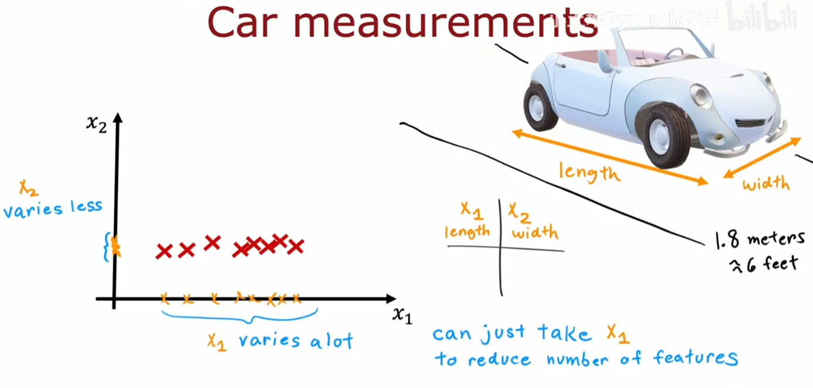
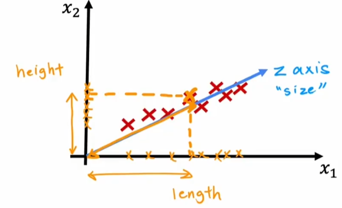
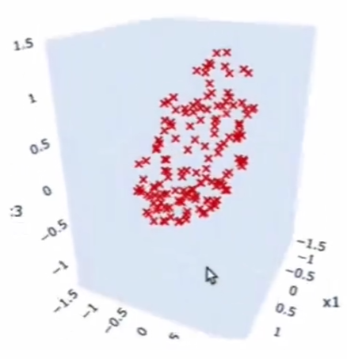
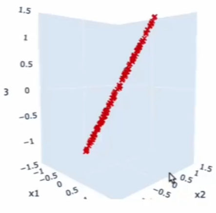
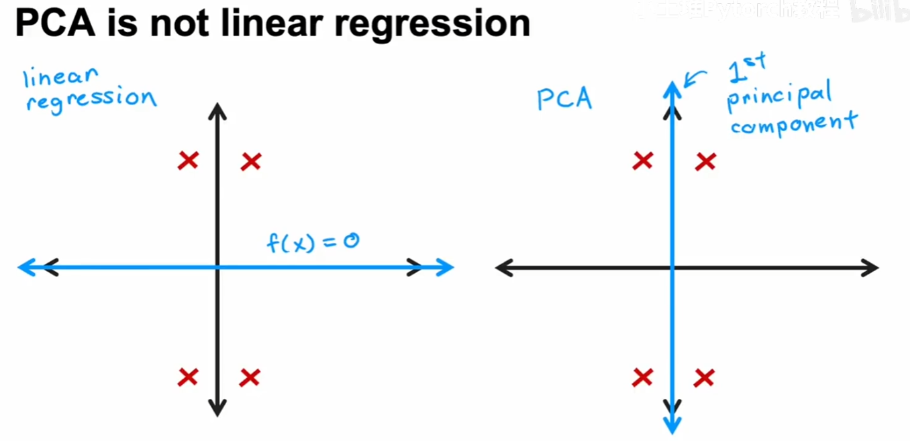
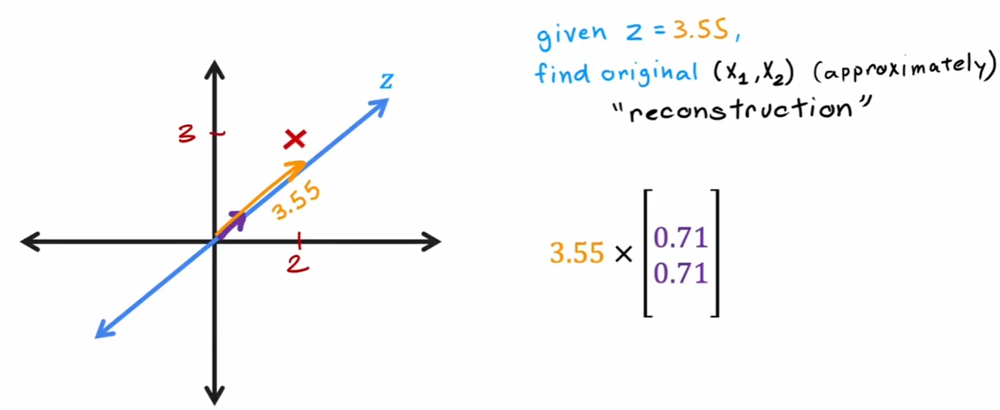
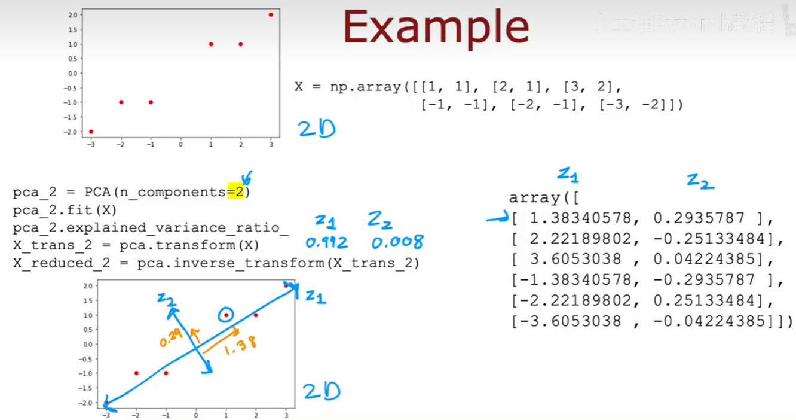

# 减少特征数量

我们无法可视化一个高维的特征向量，但是PCA可以**将特征维数减少**为2~3

由于路宽，一个车子的长、宽虽然有两个维度，但是我们只需要考虑长度即可 

但如果把宽度变为高度呢？每个车貌似都不同，每个维度都包含信息，PCA会这么做（实际上别的也是这么做：创建新轴）  
这时就会发现，我们只取z轴，就把特征减少到1了

 

本来是三维的，但是某个投影变成直线了，我们就可以找到一个平面（z-axis），这样，三维就变成二维了

# PCA算法

我们有几个数据点（没有任何坐标轴），PCA就是要找一条轴（主成分），使得每个数据点在其上投影的位置的方差最大（分散的最开），这也等价于最小化每个点到主成分的距离距离和

如果你还想取一个轴，这个轴一定和一开始的轴正交

 这个图不是让你以为你在做拟合。线性回归做的事是最佳拟合一条直线，而PCA是在找压缩信息的可能性

Reconstruction：从压缩维度的信息还原原来的信息（有损） 
 
$(2,3)$在主成分( $l:y=x$ )上的投影长度是3.55，乘以该轴方向的单位向量($[0.71, 0.71]^T$)即可还原 
误差的来源就是原来的点和主成分的距离（这一段信息直接消失了）

# PCA实现

我们需要先对数据进行归一化处理，使得均值在原点

使用scikit-learn，具体见Lab 

**PCA主要用于可视化数据**
